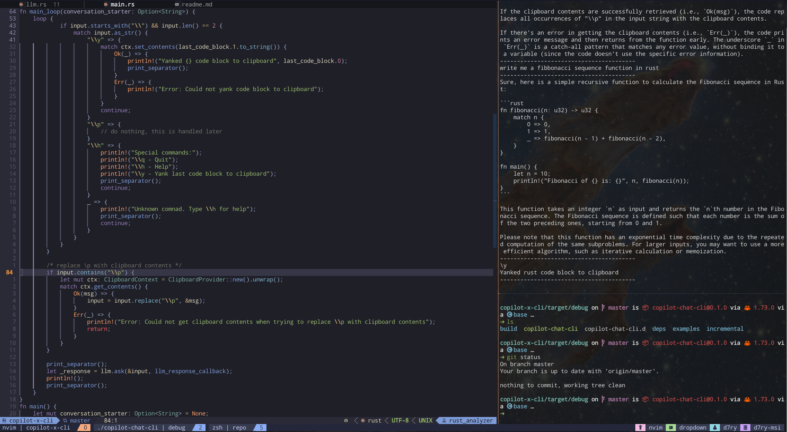
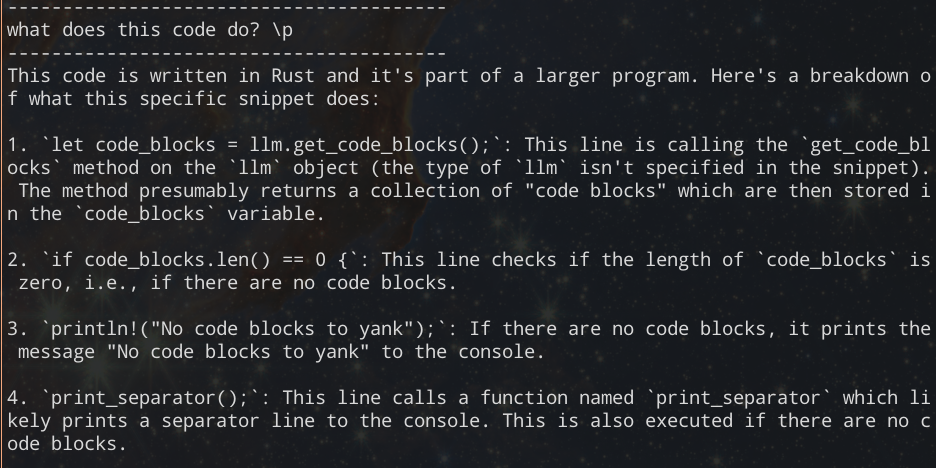
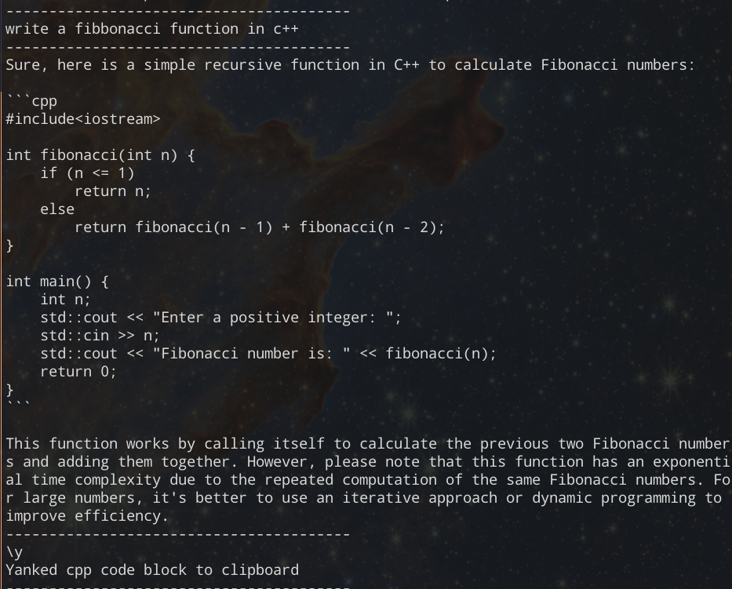

# Copilot-X CLI

A very simple WIP cli tool interfacing with github copilot-x's API

## Requirements

A machine authorized with github-copilot. If you've previously set up copilot on VSC,
your machine should be automatically authorized.

To check, navigate to `.config/github-copilot/hosts.json` and see if your copilot credentials are in
there.

## Philosophy

I like deft command line utilities. While there are a million amazing chatgpt/copilot/other LLM
clis out there, I'd like to have something straightforward that integrates easily into my workflow.
This cli tool doesn't create its dedicated GUI -- it simply flushes the copilot's output to stdout,
which you can yank and inspect with your favorite term emulator. It also provides some handy
features so that your hands _don't need to leave the keyboard again_, if you use vim(btw).

## Features

#### Quick pasting

When sending commands to the copilot, your `\p` input is automatically replaced with the clipboard's
content. This allows you to yank a code block in vim, and just _blazingly fastly_ tmux to another
window and ask the question regarding the code block.

#### Quick yanking

After getting response from the copilot, simply input `\y`. Instead of querying the copilot, the
program yeets the most recent code block generated by the copilot back to your clipboard.

#### (Experimental) Copilot Jailbreak

Github copilot likes to reject everything that's remotely not coding related. Turns out all you have
to do is to send the same request twice, upon getting the 400 response from the API endpoint.
Jailbreak is enabled by default and currently can't be disabled.

## TODO

- [ ] very simple serialization scheme
- [ ] toggleable jail break
- [ ] customizable system prompt
- [ ] a better version of copilot cli?
- [ ] dynamic syntax highlighting

